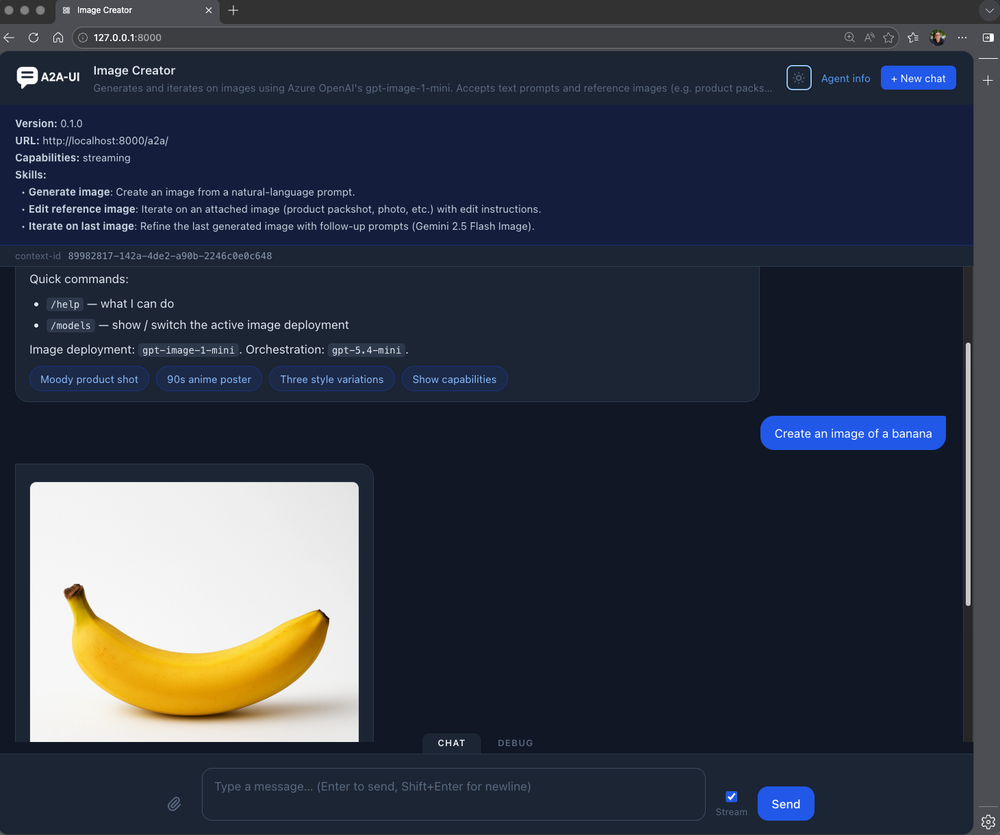
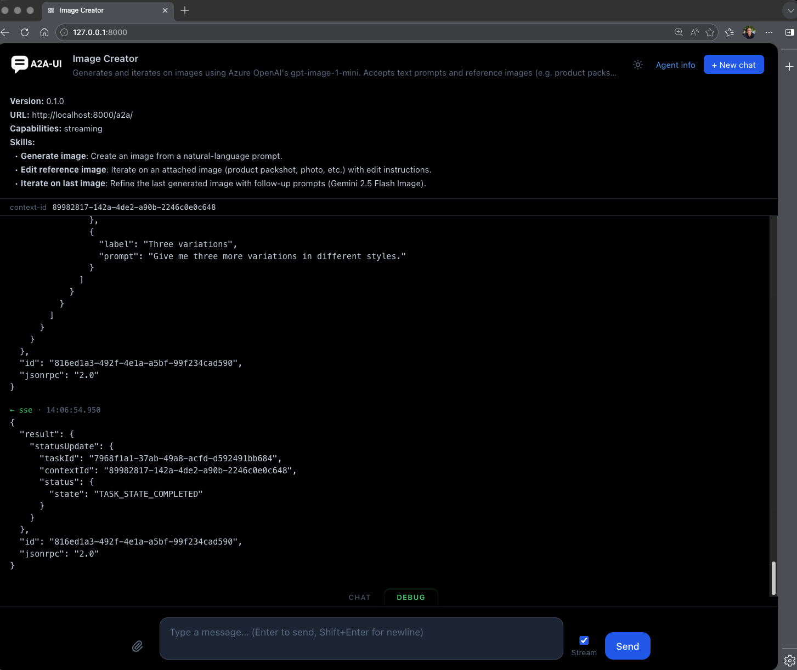

# fast_a2a_app

**Drop-in A2A server and chat UI for any FastAPI application running AI agents — installable from PyPI.**

```bash
pip install fast_a2a_app
```

---

## Why fast_a2a_app

The [Agent2Agent (A2A) protocol](https://a2a-protocol.org/) is HTTP for AI agents — a shared contract that lets any agent talk to any client (chat UI, orchestrator, another agent) across companies and frameworks. Turning a Python coroutine into a spec-compliant A2A server is a lot of plumbing: JSON-RPC routes, SSE streaming, task lifecycle, cross-instance cancel, agent-card discovery, multi-turn history. fast_a2a_app does it for you, mounted cleanly into the FastAPI app you already run.

- 🔌 **Mount, don't replace.** Starlette app you mount at any path prefix. Auth, middleware, CORS, observability — all yours, unchanged.
- 🧱 **Framework-agnostic.** No dependency on Pydantic AI, LangChain, or any agent runtime. Wrap any `async (str) -> str` (or async generator) and you're done.
- 💬 **Batteries-included chat UI.** Self-contained browser interface — no build step, no npm. Markdown, tables, maps, clickable suggestions, file uploads, image previews, fullscreen viewer.
- 🧩 **Typed-artifact widgets you can extend.** Drop a `<TAG>.py` + `<TAG>.js` pair to add a new chat widget; built-ins ship `TABLE`, `PROMPT_SUGGESTIONS`, and `MAP` (Leaflet).
- 📡 **Real protocol, not a mock.** Streaming SSE, multi-turn history, cross-instance cancel, reload recovery, agent-card discovery — built on `a2a-sdk` 1.0.x.

---

## 60-second quickstart

One file, three lines of glue — and you get a fully spec-compliant streaming A2A server with a built-in chat UI on top of an Azure OpenAI chat-completions call:

```python
# main.py
import os
from collections.abc import AsyncIterable

from fastapi import FastAPI
from a2a.types import AgentCapabilities, AgentCard, AgentInterface
from fast_a2a_app import a2a_ui, build_a2a_app, build_stream_invoke

from azure.identity.aio import AzureCliCredential, get_bearer_token_provider
from openai import AsyncOpenAI


# Azure OpenAI client — bearer token from `az login` (no API key needed).
client = AsyncOpenAI(
    base_url=f"{os.environ['AZURE_AI_BASE_URL'].rstrip('/')}/openai/v1",
    api_key=get_bearer_token_provider(AzureCliCredential(), "https://ai.azure.com/.default"),
)

# Your agent: any async generator yielding text chunks.
async def stream_chat(prompt: str) -> AsyncIterable[str]:
    stream = await client.chat.completions.create(
        model=os.environ.get("AZURE_AI_DEPLOYMENT_NAME", "gpt-4o"),
        messages=[{"role": "user", "content": prompt}],
        stream=True,
    )
    async for chunk in stream:
        if chunk.choices and (text := chunk.choices[0].delta.content):
            yield text

# A2A agent card — public metadata served at /a2a/.well-known/agent-card.json
agent_card = AgentCard(
    name="Chat",
    description="Streaming chat agent",
    version="1.0.0",
    supported_interfaces=[
        AgentInterface(url="http://localhost:8000/a2a/", protocol_binding="JSONRPC")
    ],
    capabilities=AgentCapabilities(streaming=True),
    default_input_modes=["text"],
    default_output_modes=["text"],
)

# Mount the A2A protocol server and the chat UI into your FastAPI app.
app = FastAPI()
app.mount(
    "/a2a",
    build_a2a_app(agent_card=agent_card, stream_invoke=build_stream_invoke(stream_chat)),
)
app.mount("/", a2a_ui)
```

```bash
pip install fast_a2a_app openai azure-identity
az login                                         # AzureCliCredential
export AZURE_AI_BASE_URL=https://<your-resource>.openai.azure.com
export AZURE_AI_DEPLOYMENT_NAME=gpt-4o
uvicorn main:app --reload
```

No Docker needed for local development — the default in-process `MemoryTaskStore` keeps task state in RAM. For multi-process / cross-instance deployments, pass `task_store=RedisTaskStore.from_url(REDIS_URL)` (or a `MongoTaskStore` / `PostgresTaskStore`) to `build_a2a_app`.

Open <http://localhost:8000/> — you're chatting.

---

## Built-in A2A-UI

A self-contained, zero-build browser chat — drop it in via `app.mount("/", a2a_ui)` and you have a working interface for trying, demoing, and sharing your agent. Streams tokens as they arrive, preserves multi-turn history across page reloads, and renders text, data, file, image, **table**, **prompt-suggestion**, and **map** artifacts inline. The renderer for each typed artifact lives in its own `<TAG>.js` file under `fast_a2a_app/ui/renderers/`, so adding a new chat widget is a one-file change — see [How-to → UI rendering conventions](docs/how-to.md#ui-rendering-conventions).



__Built-in debug view__

A **Debug** tab in the chat UI surfaces full task state, JSON-RPC request/response payloads, and the streaming wire log — useful while iterating on tools, prompts, or multi-part artifacts. 



---

## Examples

| Example | What it shows | API key |
|---|---|---|
| [Echo Agent](examples/echo-agent/README.md) | Minimal integration — pure Python, no LLM | No |
| [Echo Multipart](examples/echo-multipart/README.md) | Streaming multi-part responses (text + JSON data + file download) | No |
| [Joke Agent](examples/joke-agent/README.md) | Raw chat completions, no agent framework | Azure OpenAI |
| [Image Creator](examples/image-creator/README.md) | Multi-tool agent: image generation, web search, fullscreen viewer, prompt suggestions, in-agent slash commands | Azure OpenAI |
| [Holiday Planner](examples/holiday-planner/README.md) | Pydantic-ai agent with tools, live progress, **interactive map** of suggested destinations, artifact-aware quick-reply pills (click a destination to advance) | Azure OpenAI |


Every example follows the same two-file layout: `agent.py` owns the `agent_card`, `invoke` / `stream_invoke`, and any tools or prompts; `main.py` is a thin FastAPI composition root that imports them and calls `build_a2a_app`. Keeping the AgentCard next to the agent functions means the agent's metadata, skills, and behaviour live together.

The first three examples (Echo Agent, Echo Multipart, Joke Agent) run on the in-process `MemoryTaskStore` and need no external service. The remaining examples opt into Redis when `REDIS_URL` is set in the environment (and fall back to memory otherwise).

### Running an example with Poetry

The examples don't ship their own `requirements.txt` — they share the parent project's dependency set, which already includes everything they need (`openai`, `azure-identity`, `pydantic-ai`, `folium`, …). One install at the repo root is enough for all examples.

```bash
# From the repo root — one-time
poetry install                                  # installs fast_a2a_app + all example deps

# Optional shared config (Azure-backed examples only)
cp examples/.env.example examples/.env          # then edit AZURE_AI_BASE_URL / AZURE_AI_DEPLOYMENT_NAME

# Run any example from its own directory
cd examples/joke-agent
poetry run uvicorn main:app --reload
```

The Azure-backed examples (`joke-agent`, `image-creator`, `holiday-planner`) additionally need `az login` for the `AzureCliCredential` bearer token. See each example's README for its specific extras (Redis, `IMAGE_SIZE`, etc.).

---

## Documentation

- **[Design choices](docs/design.md)** — what the library is, what it isn't, and the trade-offs behind those decisions
- **[Architecture](docs/architecture.md)** — module layout, storage, conversation history injection, the streaming pipeline
- **[API reference](docs/api.md)** — every public symbol with parameters and examples
- **[How-to guides](docs/how-to.md)** — prompt management, multi-part artifacts, image uploads, progress reporting, custom storage backends

---

## License

MIT
